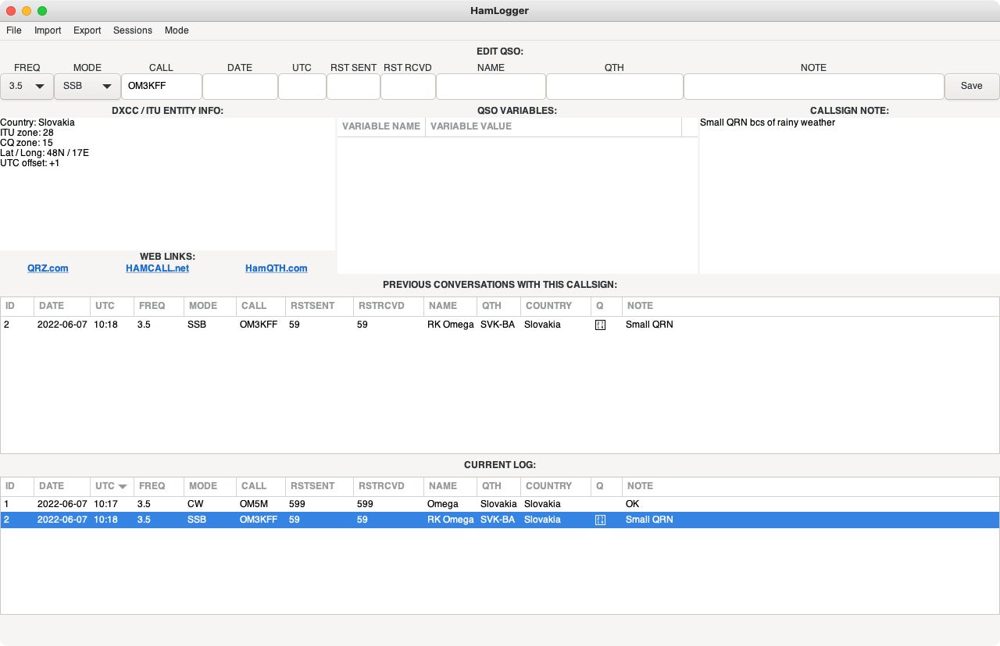
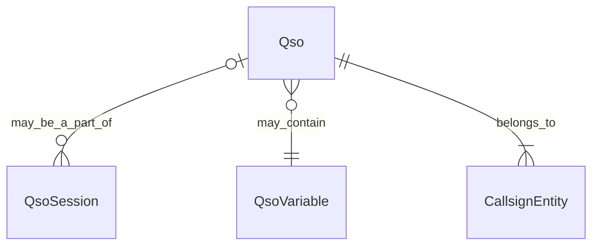

## Simple Python Ham Radio Logger using Gtk3

<p align="center"></p>

This is my attempt to produce a working HAM radio logging software in Python.
This is the first working version and should be considered very very pre alpha.
It is free software, please download, test, send feedback and let me know ifd
you feel you would like to contribute.


## Why?

I am an exclusive GNU/Linux user. This is largely inspired by a program called
Xlog <http://xlog.nongnu.org/>. It is a great and fast piece of software, it
is free, it uses a plain-text database, but it's GUI is not the single most
perfect piece I have used. So I decided that because of this and largely for
learning purposes I would write something myself.


## Requirements and philosophy

I needed something simple for general ragchewing. I'm a beginning ham without
much experience and my requirements may change as I begin exploring digital
modes, CW, contesting etc.

I really aim for standard technologies, simple solutions and  not having to
run any database servers and emulators. I needed to see who I am contacting,
what is the local time for the station, past qsos and perhaps some details
I can pull from the Internet.

Future plans include a separate application which could run full-screen on a
secondary monitor and display the full callsign with a country, maybe a
spot on the world map and possibly a photo or additional info for public
ham radio presentations.

## How to install and run

If you have a working Python installation, just download the project and run
`python hamlogger.py`. The database file will be created and kept in the db
subfolder.

When using virtualenv:
```
python3.10 -m virtualenv venv
source ./venv/bin/activate
pip install -U pip
pip install .
python ./hamlogger
```

When on MacOS:
You need to install some additional libraries.
```
brew install cairo
brew install gtk+3 gobject-introspection
```

## Technologies

- Python (3.9 used for development)
- SQLAlchemy
- Gtk3
- SQLite3

## Current functionality

- recording basic QSO variables (call, rst, band, mode, name, qth, note) and
  editing, deleting qsos

- callsign notes (notes that are persistent for callsign entities (for example
  when you have qsos with callsign OE/OM1AWS, OM1AWS/p and OM1AWS, the program
  recognizes that these are all essentially one callsign and you can have a
  note for this person that is visible across all variations of the callsign
  and all qsos recorded. (to keep a person's phone number, email, address, ..)

- opendocument spreadsheet (ODS) import and export (partially implemented)

- export ADIF v.2 (only basic QSO details)

- export SOTA CSV file

## Development

### User scripts

HamLogger was written mainly to give the user more power over the application and
make whatever exports very easy to write on your own.

Users can put any custom scripts to lib/tools/scripts and use the --run command
line option to run them. There scripts have access to the app object, the db
session handle (SQLite) and config.

Example:

```
hamlogger.py --run my_script [arg1 arg2 ... ]
```

You create a file lib/tools/scripts/my_script.py:
```python
#!/usr/bin/env python

def execute(db_handle, app, args):
    # db_handle: the application's DataConnector (data_connector.py) with 
    #     all the helper functions. db_handle.session is the original SQLAlchemy
    #     session object.
    #
    # app: application object
    #
    # args: a list containing the rest of your arguments
    #    [ arg1, arg2, ... ]

```

### Data Model
A *QsoSession* is a means of organizing *Qso*s to groups. a *QsoSession* can be a single 
ADIF import or you running a contest. 

A *Qso* is the basic record with all the necessary variables such as *frequency*, *datetime_utc*,
*mode*,*callsign* and others. Any other custom variables are saved in *QsoVariables* to allow for 
maximum flexibility.

*CallsignEntity* is a esstentially a person. OE/OM1WS/P, OM1WS are the same person and you might
want to treat it that way.



### Testing
Simply run `make test` in the main directory.

Usage

### Keyboard shortcuts

  CTRL-Z   Clear QSO fields and focus on the callsign box. 
           (failed QSO)

  CTRL-A   Increase QSO time by 1 minute
  CTRL-X   Decrease QSO time by 1 minute
  
  CTRL-L   Lock focused widget in place (adding QSOs from an older date without
           having to type it again)

